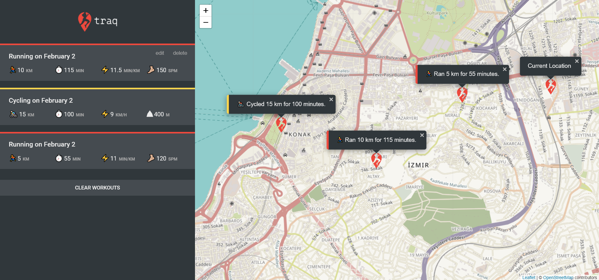

# [Traq](https://netflix-clone-2501d.web.app/)
> by [Ahmet Alper](https://github.com/ahmetalpergit)
# 

## Introduction

Traq is a desktop web application that allows you to track your running and cycling events all over the world.

### Technologies

HTML - CSS - JS - Firebase

### Libraries

* [leaflet](https://leafletjs.com/)

```sh
   npm i leaflet
```
### API

The app is using the Geolocation API in order to locate the user's position.

### Features

* Geolocation and tracking user's current position.
* Leaflet library allows the use of maps and customised markers.
* Add, edit or delete your workouts with an intuitive UI.

## Thank you!

Thank you so much for checking out my project! If you have any notes or bugs send them my way and I'll make sure they're fixed.